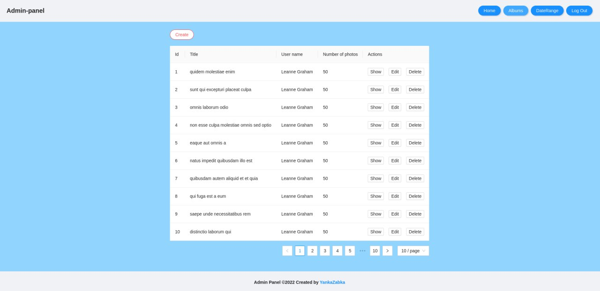

# Admin panel :fire:
Welcome to project Readme! 

## Demo link: :paperclip:
Access my site at [Vercel](https://admin-panel-gray-three.vercel.app). For login, use **'Sincere@april.biz'**  email and any password that matches the conditions of the form.

## About The App :books:
Admin panel is an app with authentication and authorization. After authorization, several tables with cruds actions `show, edit, delete` will be available inside. Table content is loaded from [API](https://graphqlzero.almansi.me/api).

## Screenshots :camera:

## Technologies :atom_symbol:
I used `React`, `Typescript`, `Antd` ,`GraphQl`, `Apollo/client`, `React-router`.

## Setup :computer:
- download or clone the repository
- run `yarn setup`
- download graphql's schema from `REACT_APP_API_URL` and generate typings of graphql files.

## Approach :walking:
I adopted the `DUCKS`  and `Atomic Design` folder structure for my react components.
